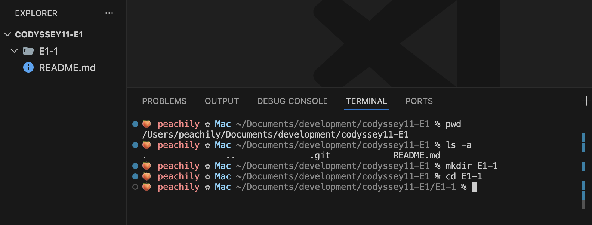
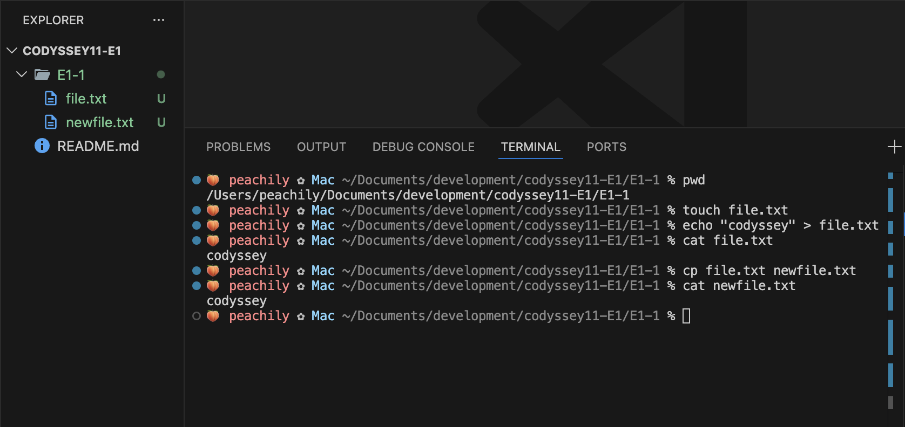
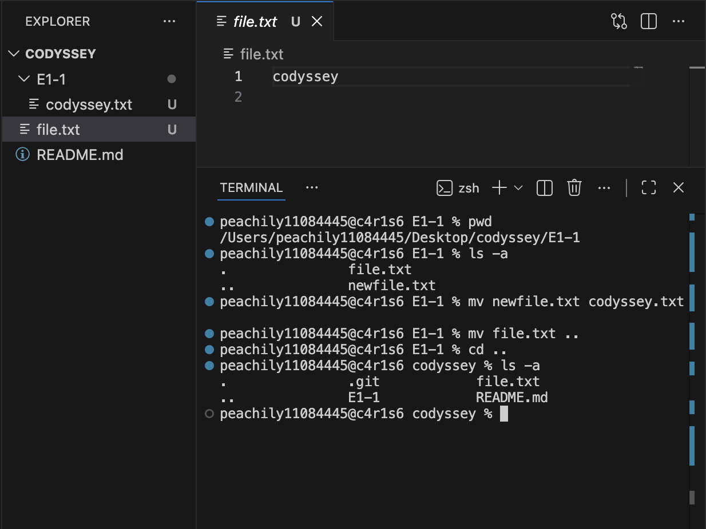
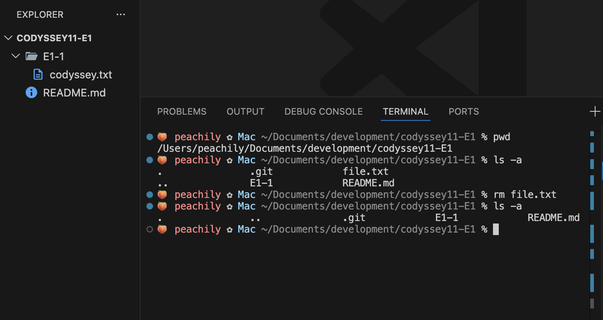
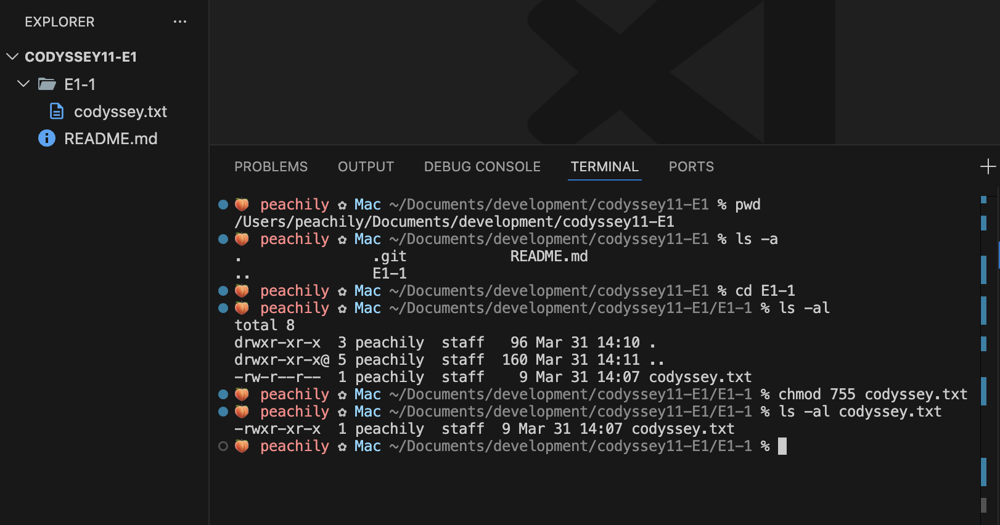
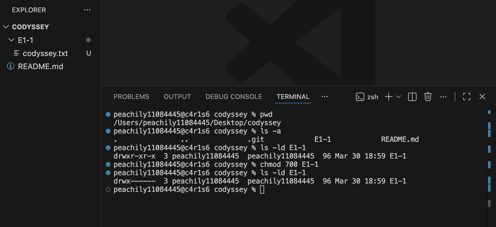
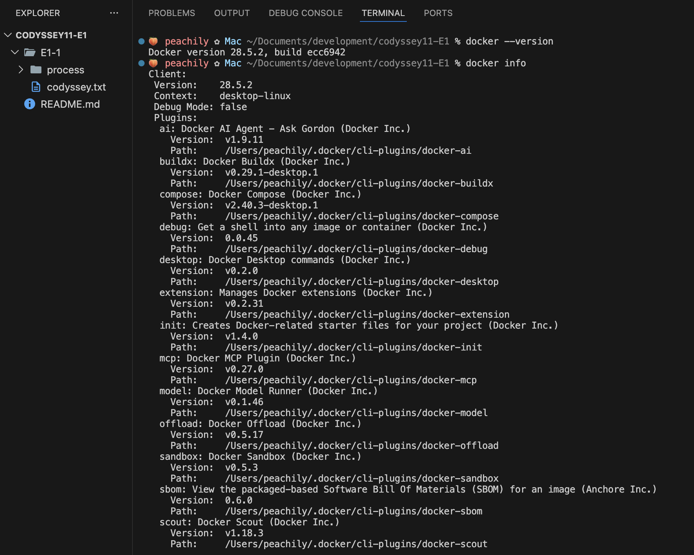
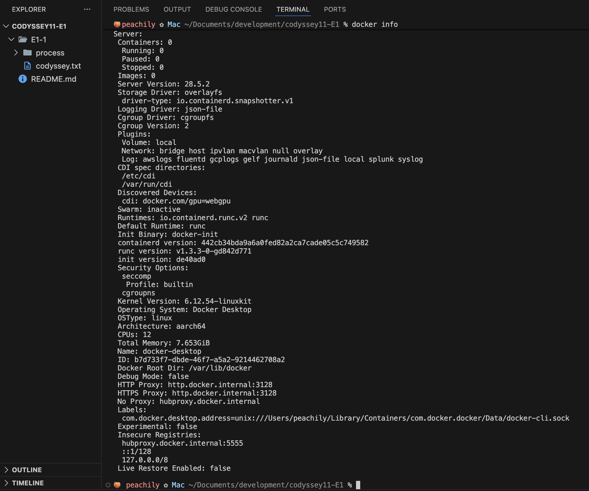

# [E1-1] AI/SW 개발 워크스테이션 구축
---
## 목차
| | |
|---|---|
| 1 | [터미널](#1-터미널) |
| 2 | [파일 권한](#2-파일-권한) |
| 3 | [Docker](#3-docker) |
| 4 | [Github 연동](#4-github-연동) |
| 5 | [트러블 슈팅](#5-트러블-슈팅) |
| | |
---
## 1. 터미널
### 1-1. 정의
- 사용자와 운영체제 간의 문자 기반 인터페이스
- 명령어를 통해 파일 시스템 탐색, 프로그램 실행, 시스템 제어 등을 수행할 수 있는 환경
- 모든 명령은 현재 작업 위치(디렉토리)를 기준으로 수행됨 → 경로 확인 필요

### 1-2. 동작 방식
```
(사용자) → (터미널) → (셸) → 운영체제
```
1) 사용자: 명령어 입력
2) 터미널: 입력과 출력이 이루어지는 인터페이스
3) 셸: 명령어를 해석하고 운영체제(OS)에 전달
4) 운영체제(OS): 실제 작업 수행 후 결과 반환

### 1-3. 경로
#### 1) 절대 경로
- 루트 디렉토리(`/`)부터 시작하는 전체 경로
- 예시:
```bash
/Users/peachily/Documents/development/codyssey11-E1/E1-1/file.txt
```
#### 2) 상대 경로
- 현재 작업 위치를 기준으로 표현하는 경로
- 예시
    - 현재 디렉토리 (현재 작업 위치와 같은 폴더 안에 있는 파일의 상대경로)
    ```bash
    ./file.txt
    ```
    - 상위 디렉토리 (현재 작업 위치보다 한 단계 상위 폴더에 있는 파일의 상대경로)
    ```bash
    ../README.md 
    ```
    - 홈 디렉토리 (사용자의 기본 작업 폴더인 ```/Users/<계정이름>```을 ```~```로 줄임)
    ```bash
    ~/Desktop
    ```

### 1-4. 명령어
#### 1) 디렉토리 생성 / 이동
- `pwd` : 현재 작업 디렉토리의 절대 경로를 출력
- `ls -a` : 현재 디렉토리의 파일 목록 확인 (숨김 파일 포함)
    - `ls -l` : 상세 정보 확인
- `mkdir` : 새로운 디렉토리 생성
    - `mkdir -p` : 여러 단계 디렉토리 한 번에 생성
- `cd` : 디렉토리 이동
    - `cd ..` : 상위 디렉토리로 이동
<details>
<summary>실습 내용</summary>


</details>

#### 2) 파일 생성 / 확인 / 복사
- `touch` : 빈 파일 생성
- `echo "<내용>" > <파일명>` : 파일 생성과 동시에 내용 작성
    - `echo "<내용>" >> <파일명>` : 기존 내용 유지 + 추가
- `cat` : 파일 내용 출력
- `cp` : 파일 복사
    - `cp -i` : 덮어쓰기 전 확인

<details>
<summary>실습 내용</summary>


</details>

#### 3) 파일 이동 / 이름 변경
- `mv` : 파일 이동 또는 이름 변경
    - `mv <파일명> <경로>` : 파일 이동
    - `mv <파일명> <변경할 이름>` : 파일 이름 변경
    - `mv -i` : 덮어쓰기 전 확인
    - `mv -i` : 기존 파일이 있으면 덮어쓰지 않음

<details>
<summary>실습 내용</summary>


</details>

#### 4) 파일 삭제
- `rm` : 파일 삭제
    - `rm -r` : 디렉토리 삭제
    - `rm -i` : 삭제 전 확인 (`rm`은 휴지통을 거치지 않고 바로 삭제됨)

<details>
<summary>실습 내용</summary>


</details>

---
## 2. 파일 권한

### 2-1. 의미
- 리눅스(Unix) 계열 시스템에는 모든 파일과 디렉토리에 접근 권한이 존재
- 어떤 사용자가 해당 파일을 읽고, 수정하고, 실행할 수 있는지를 제어
- 시스템 보안과 파일 접근 제어를 위해 사용

### 2-2. 표현 방법
- `ls -l` 명령어로 확인 → 10글자의 문자열 형태
    - 1번째: 파일 종류 (`-`: 파일 / `d`: 디렉토리)
    - 2~4번째: user(소유자)의 권한
    - 5~7번째: group(그룹)의 권한
    - 8~10번째: others(그 외 사용자)의 권한
- 권한은 알파벳 또는 숫자로 표현
    - `r`(read)=4 : 파일 내용 읽기 / 디렉토리 내부 목록 조회
    - `w`(write)=2 : 파일 수정, 삭제 / 디렉토리 내부 파일 생성, 삭제
    - `x`(execute)=1 : 파일 실행 / 디렉토리 접근(`cd`)
- 문자열 표현 예시
    ```-rw-r--r--```
    - 파일 종류: `-` → 파일
    - user: `rw-` → 읽기, 쓰기 가능
    - group: `r--` → 읽기 가능
    - others: `r--` → 읽기 가능
- 숫자 표현 예시
    ```755```
    - user: 7 (= 4+2+1) → rwx → 읽기, 쓰기, 실행 가능
    - group: 5 (= 4+1) → r-x → 읽기, 실행 가능
    - others: 5 (= 4+1) → r-x → 읽기, 실행 가능

### 2-3. 권한 변경
```chmod <권한 숫자> <변경할 대상>```
- 파일
    - `ls -al` : 파일 권한 포함 상세 정보 확인
    - `chmod <권한 숫자> <파일명>` : 파일 권한 변경

<details>
<summary>실습 내용</summary>


</details>

- 디렉토리
    - `ls -ld` : 디렉토리 권한 확인
    - `chmod <권한 숫자> <디렉토리명>` : 디렉토리 권한 변경

<details>
<summary>실습 내용</summary>


</details>

---
## 3. Docker

### 3-1. 기본 사항
#### 1) 개념
- 애플리케이션과 실행 환경을 이미지로 묶고, 이를 컨테이너 형태로 실행하는 기술
    - 이미지: 애플리케이션 실행에 필요한 환경과 설정을 포함한 템플릿 (설계도)
    - 컨테이너: 이미지를 기반으로 실행된 인스턴스 (실행 결과물)
- 같은 이미지를 사용하면 실행 환경을 재현하기 쉬움 → 개발 환경이 달라질 때 동작하지 않는 문제 ↓
- Linux 커널에만 존재하는 기능들(리소스 제한, 프로세스 격리 등)을 기반으로 동작

#### 2) 동작 구조
```(사용자) → (터미널) → (Docker CLI) → (Docker Daemon) → (컨테이너 실행)```
- 터미널: 명령어를 입력하는 환경
- Docker CLI: 사용자의 명령어를 받아 Docker에 전달하는 CLI 프로그램 (`docker` 명령어)
- Docker Daemon: 실제로 컨테이너를 생성하고 실행하는 백그라운드 프로그램
    - Unix 계열 운영체제인 macOS에서는 Docker Desktop, OrbStack 등의 도구를 통해 가상 Linux 환경을 먼저 구성해야 Docker를 실행할 수 있음

#### 3) 설치
- ```docker --version``` : Docker CLI 설치 여부 및 버전 정보 확인
- ```docker info``` : Docker Daemon 실행 상태, 클라이언트와 서버 정보, 실행 환경, 플러그인 등 확인

<details>
<summary>실습 내용</summary>



</details>

### 3-2. 이미지와 컨테이너
### 3-3. 웹 서버 실행과 포트 매핑
### 3-4. Docker 기본 운영 명령
### 3-5. Dockerfile 기반 커스텀 이미지
### 3-6. 바인드 마운트
### 3-7. 볼륨과 영속성
### 3-8. Docker Compose
#### 1) 단일 서비스 실행
#### 2) 환경 변수
#### 3) 멀티 컨테이너

---
## 4. Github 연동

---
## 5. 트러블 슈팅
