# [E1-1] AI/SW 개발 워크스테이션 구축
---
## 목차
| | |
|---|---|
| 1 | [터미널](#1-터미널) |
| 2 | [파일 권한](#2-파일-권한) |
| 3 | [Docker](#3-docker) |
| 4 | [Github 연동](#4-github-연동) |
| 5 | [트러블 슈팅](#5-트러블-슈팅) |
| | |
---
## 1. 터미널
### 1-1. 정의
- 사용자와 운영체제 간의 문자 기반 인터페이스
- 명령어를 통해 파일 시스템 탐색, 프로그램 실행, 시스템 제어 등을 수행할 수 있는 환경
- 모든 명령은 현재 작업 위치(디렉토리)를 기준으로 수행됨 → 경로 확인 필요

### 1-2. 동작 방식
```
(사용자) → (터미널) → (셸) → 운영체제
```
1) 사용자: 명령어 입력
2) 터미널: 입력과 출력이 이루어지는 인터페이스
3) 셸: 명령어를 해석하고 운영체제(OS)에 전달
4) 운영체제(OS): 실제 작업 수행 후 결과 반환

### 1-3. 경로
#### 1) 절대 경로
- 루트 디렉토리(`/`)부터 시작하는 전체 경로
- 예시:
```bash
/Users/peachily/Documents/development/codyssey11-E1/E1-1/file.txt
```
#### 2) 상대 경로
- 현재 작업 위치를 기준으로 표현하는 경로
- 예시
    - 현재 디렉토리 (현재 작업 위치와 같은 폴더 안에 있는 파일의 상대경로)
    ```bash
    ./file.txt
    ```
    - 상위 디렉토리 (현재 작업 위치보다 한 단계 상위 폴더에 있는 파일의 상대경로)
    ```bash
    ../README.md 
    ```
    - 홈 디렉토리 (사용자의 기본 작업 폴더인 `/Users/<계정이름>`을 `~`로 줄임)
    ```bash
    ~/Desktop
    ```

### 1-4. 명령어
#### 1) 디렉토리 생성 / 이동
- `pwd` : 현재 작업 디렉토리의 절대 경로를 출력
- `ls -a` : 현재 디렉토리의 파일 목록 확인 (숨김 파일 포함)
    - `ls -l` : 상세 정보 확인
- `mkdir` : 새로운 디렉토리 생성
    - `mkdir -p` : 여러 단계 디렉토리 한 번에 생성
- `cd` : 디렉토리 이동
    - `cd ..` : 상위 디렉토리로 이동
<details>
<summary>실습 내용</summary>


</details>

#### 2) 파일 생성 / 확인 / 복사
- `touch` : 빈 파일 생성
- `echo "<내용>" > <파일명>` : 파일 생성과 동시에 내용 작성
    - `echo "<내용>" >> <파일명>` : 기존 내용 유지 + 추가
- `cat` : 파일 내용 출력
- `cp` : 파일 복사
    - `cp -i` : 덮어쓰기 전 확인

<details>
<summary>실습 내용</summary>


</details>

#### 3) 파일 이동 / 이름 변경
- `mv` : 파일 이동 또는 이름 변경
    - `mv <파일명> <경로>` : 파일 이동
    - `mv <파일명> <변경할 이름>` : 파일 이름 변경
    - `mv -i` : 덮어쓰기 전 확인
    - `mv -i` : 기존 파일이 있으면 덮어쓰지 않음

<details>
<summary>실습 내용</summary>


</details>

#### 4) 파일 삭제
- `rm` : 파일 삭제
    - `rm -r` : 디렉토리 삭제
    - `rm -i` : 삭제 전 확인 (`rm`은 휴지통을 거치지 않고 바로 삭제됨)

<details>
<summary>실습 내용</summary>


</details>

---
## 2. 파일 권한

### 2-1. 의미
- 리눅스(Unix) 계열 시스템에는 모든 파일과 디렉토리에 접근 권한이 존재
- 어떤 사용자가 해당 파일을 읽고, 수정하고, 실행할 수 있는지를 제어
- 시스템 보안과 파일 접근 제어를 위해 사용

### 2-2. 표현 방법
- `ls -l` 명령어로 확인 → 10글자의 문자열 형태
    - 1번째: 파일 종류 (`-`: 파일 / `d`: 디렉토리)
    - 2~4번째: user(소유자)의 권한
    - 5~7번째: group(그룹)의 권한
    - 8~10번째: others(그 외 사용자)의 권한
- 권한은 알파벳 또는 숫자로 표현
    - `r`(read)=4 : 파일 내용 읽기 / 디렉토리 내부 목록 조회
    - `w`(write)=2 : 파일 수정, 삭제 / 디렉토리 내부 파일 생성, 삭제
    - `x`(execute)=1 : 파일 실행 / 디렉토리 접근(`cd`)
- 문자열 표현 예시
    ```-rw-r--r--```
    - 파일 종류: `-` → 파일
    - user: `rw-` → 읽기, 쓰기 가능
    - group: `r--` → 읽기 가능
    - others: `r--` → 읽기 가능
- 숫자 표현 예시
    ```755```
    - user: 7 (= 4+2+1) → rwx → 읽기, 쓰기, 실행 가능
    - group: 5 (= 4+1) → r-x → 읽기, 실행 가능
    - others: 5 (= 4+1) → r-x → 읽기, 실행 가능

### 2-3. 권한 변경
```chmod <권한 숫자> <변경할 대상>```
- 파일
    - `ls -al` : 파일 권한 포함 상세 정보 확인
    - `chmod <권한 숫자> <파일명>` : 파일 권한 변경

<details>
<summary>실습 내용</summary>


</details>

- 디렉토리
    - `ls -ld` : 디렉토리 권한 확인
    - `chmod <권한 숫자> <디렉토리명>` : 디렉토리 권한 변경

<details>
<summary>실습 내용</summary>


</details>

---
## 3. Docker

### 3-1. 기본 사항
#### 1) 개념
- 애플리케이션과 실행 환경을 이미지로 묶고, 이를 컨테이너 형태로 실행하는 기술
    - 이미지: 애플리케이션 실행에 필요한 환경과 설정을 포함한 템플릿 (설계도)
    - 컨테이너: 이미지를 기반으로 실행된 인스턴스 (실행 결과물)
- 같은 이미지를 사용하면 실행 환경을 재현하기 쉬움 → 개발 환경이 달라질 때 동작하지 않는 문제 ↓
- Linux 커널에만 존재하는 기능들(리소스 제한, 프로세스 격리 등)을 기반으로 동작

#### 2) 동작 구조
```(사용자) → (터미널) → (Docker CLI) → (Docker Daemon) → (컨테이너 실행)```
- 터미널: 명령어를 입력하는 환경
- Docker CLI: 사용자의 명령어를 받아 Docker에 전달하는 CLI 프로그램 (`docker` 명령어)
- Docker Daemon: 실제로 컨테이너를 생성하고 실행하는 백그라운드 프로그램
    - Unix 계열 운영체제인 macOS에서는 Docker Desktop, OrbStack 등의 도구를 통해 가상 Linux 환경을 먼저 구성해야 Docker를 실행할 수 있음

#### 3) 설치
- `docker --version` : Docker CLI 설치 여부 및 버전 정보 확인
- `docker info` : Docker Daemon 실행 상태, 클라이언트와 서버 정보, 실행 환경, 플러그인 등 확인

<details>
<summary>실습 내용</summary>


</details>

### 3-2. 이미지와 컨테이너
#### 1) 이미지 다운로드 및 컨테이너 실행
- 레지스트리(Docker hub)에서 `docker pull <이미지 이름>` 명령어를 통해 로컬 환경으로 다운로드
- `docker run <이미지 이름>` 명령어를 통해 컨테이너 생성하고 실행
    - 해당 이미지가 없는 경우, 이미지 다운로드(`pull`)부터 자동으로 진행됨

<details>
<summary>실습 내용</summary>

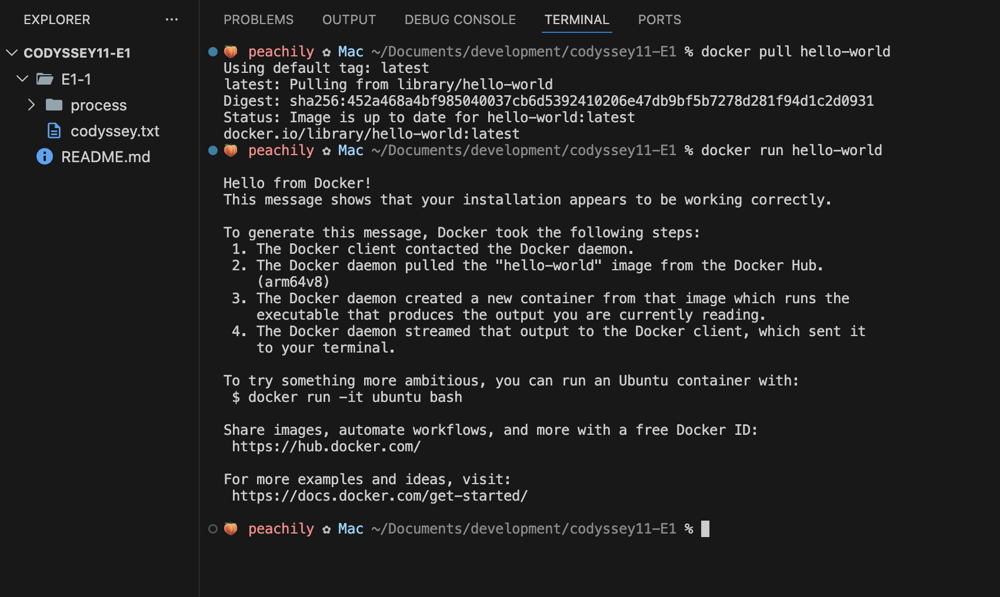
</details>

#### 2) 인터렉티브 컨테이너
- 컨테이너 내부에 직접 접속해 터미널처럼 명령어를 입력, 실행할 수도 있음
- `docker run -it <이미지 이름>`으로 `-it` 옵션을 사용해 컨테이너 내부 쉘에 접속
    - `-i`: 입력을 유지하여 사용자와 상호작용 가능하게 하는 옵션
    - `-t`: 터미널 환경을 제공하는 옵션
- 컨테이너 내부에서 실행되는 쉘은 독립된 환경으로, 파일 시스템과 프로세스가 호스트와 분리되어 동작
<details>
<summary>실습 내용</summary>

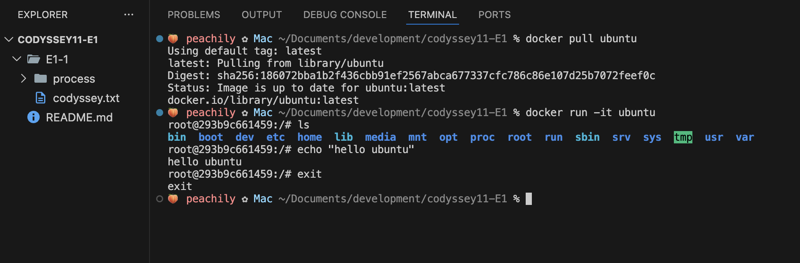
</details>

### 3-3. 웹 서버 실행과 포트 매핑
#### 1) 웹 서버 이미지
- 웹 서버: 클라이언트(브라우저)의 요청을 받아 해당하는 HTML, CSS, JS, 이미지 등의 웹 자원을 전달하는 소프트웨어 (예: nginx, Apache HTTP Server, Caddy, IIS)
- Docker를 통해 웹 서버 이미지를 실행하면, 컨테이너 내부에서 웹 서버가 동작하면서 기본 웹 페이지를 제공 → 별도의 웹 서버 설치 과정을 거치지 않고도 바로 웹 이미지를 실행할 수 있음

#### 2) 포트 매핑
- 내 컴퓨터(호스트)에서 접속할 포트와 컨테이너 내부의 웹 서버가 사용하는 포트를 연결하는 과정
- 방법
    ```docker run -d --name <컨테이너 이름> -p <호스트 포트>:<컨테이너 포트> <이미지>```
    - `-d`: 백그라운드 실행
    - `--name <컨테이너 이름>`: 컨테이너 이름 지정
    - `-p <호스트 포트>:<컨테이너 포트>`: 포트 매핑
- 포트 매핑을 하면 브라우저에서 `http://localhost:8080`으로 접속해 컨테이너 내부에서 실행 중인 웹 서버에 접근 가능
- 컨테이너는 기본적으로 외부와 격리되어 있기 때문에 포트 매핑을 설정하지 않으면 브라우저에서 접근할 수 없음
<details>
<summary>실습 내용</summary>

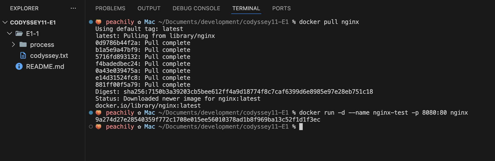
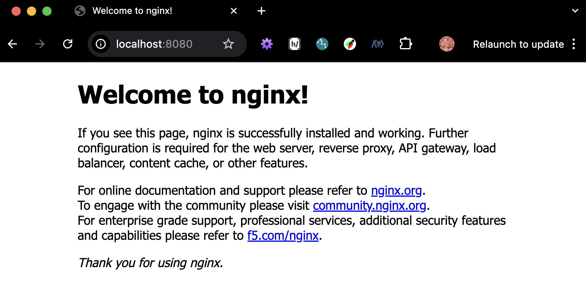
</details>

### 3-4. 컨테이너 상태 확인
- `docker images` : 로컬 환경에 저장된 이미지 목록 확인
- `docker ps` : 현재 실행 중인 컨테이너 목록 확인
    - `docker ps -a` : 종료된 컨테이너를 포함한 전체 목록 확인
<details>
<summary>실습 내용</summary>

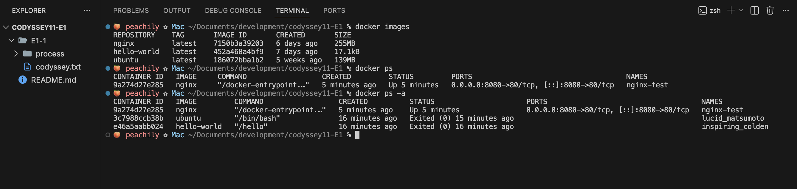
</details>

- `docker logs <컨테이너 이름 또는 ID>` : 컨테이너 실행 시 출력되었던 로그 확인 (종료된 컨테이너 포함) → 웹 서버의 경우 에러나 요청 기록 등을 확인할 때 활용됨
<details>
<summary>실습 내용</summary>

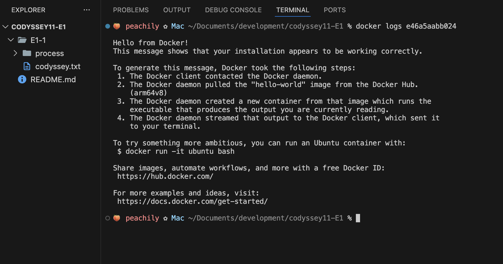
</details>

- `docker stats <컨테이너 이름 또는 ID>` : 현재 실행 중인 컨테이너의 CPU, 메모리 등의 사용량을 실시간으로 확인
<details>
<summary>실습 내용</summary>

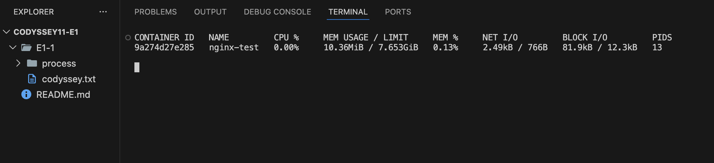
</details>

- `docker stop <컨테이너 이름 또는 ID>` : 실행 중인 컨테이너 종료
- `docker rm <컨테이너 이름 또는 ID>` : 종료된 컨테이너 삭제 → 컨테이너는 삭제되면 내부 데이터도 함께 사라지기 때문에 별도 관리 필요

### 3-5. Dockerfile 기반 커스텀 이미지
#### 1) Dockerfile
- 기본 이미지를 기반으로 원하는 실행 환경(사용자 정의 이미지)을 새로 만들 때 사용하는 빌드 설정 파일
- 파일을 이미지 내부에 복사하여 재사용 가능한 형태의 새 이미지를 만드는 방식으로, 실행 환경을 이미지 단위로 재현할 수 있음 → 파일을 수정하고 변경 내용을 반영하려면 이미지를 다시 빌드해야 함

#### 2) 파일 작성
- `docker build`를 실행하는 프로젝트 루트에 `Dockerfile` 생성 후 필요한 내용 작성
    - `FROM <베이스 이미지>` : 어떤 이미지를 기반으로 시작할지 지정 → 반드시 Dockerfile의 첫 줄에 있어야 함
    - `COPY <호스트 경로> <컨테이너 경로>` : 호스트의 파일을 이미지 내부로 복사
    - `RUN <실행할 명령어>` : 이미지 빌드 과정에서 실행할 명령어 (패키지 설치, 파일 생성 등)
    - `CMD ["<실행할 명령어>"]` : 컨테이너를 실행할 때 기본으로 실행할 명령어 지정
- 위에서 아래로 순차적으로 실행되며, 각 명령어는 새로운 레이어를 생성함

#### 3) 빌드 (build)
- `Dockerfile`을 기반으로 이미지를 생성하는 과정
- `Dockerfile` 작성 후 `docker build -t <이미지 이름> .` 명령어를 사용해 이미지 생성
    - `-t <이미지 이름>` : 생성할 이미지의 이름 지정
    - `.` : 현재 디렉토리를 빌드 컨텍스트로 사용

#### 4) 실행 (run)
- 빌드된 이미지를 기반으로 컨테이너를 생성하고 실행하는 과정
- `docker run -d --name <컨테이너 이름> -p <호스트 포트>:<컨테이너 포트> <이미지 이름>`
    - `d` : 백그라운드 실행
    - `--name <컨테이너 이름>` : 생성할 컨테이너의 이름 지정
    - `-p <호스트 포트>:<컨테이너 포트>` : 포트 매핑
    - `<이미지 이름>` : 실행할 이미지

<details>
<summary>실습 내용</summary>

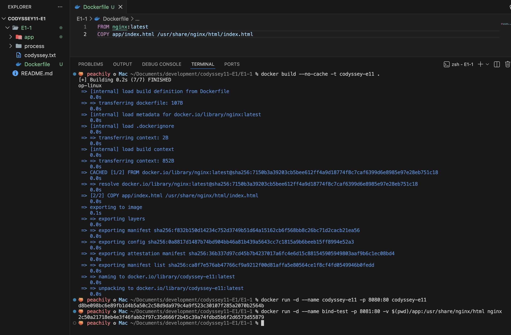
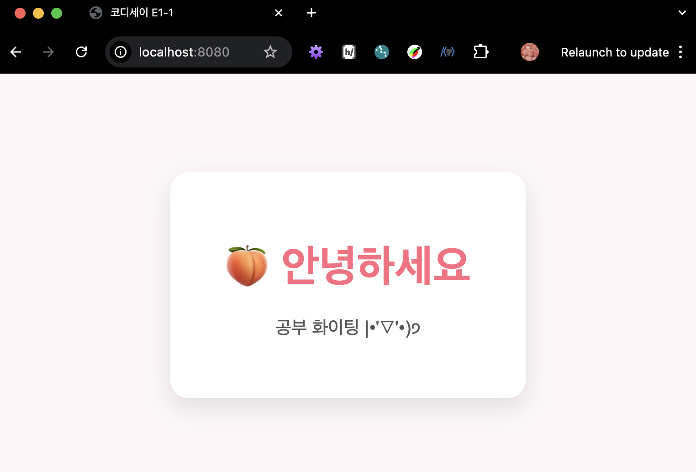
</details>

### 3-6. 데이터 관리
#### 1) 바인드 마운트
- 호스트의 디렉토리를 컨테이너 내부 경로와 직접 연결하는 방식
- 호스트에서 파일을 수정하면 컨테이너에도 즉시 반영 → 이미지를 다시 빌드하지 않아도 됨
- `docker run -d --name <컨테이너 이름> -p <호스트 포트>:<컨테이너 포트> -v <호스트 파일 경로>:<컨테이너 내부 경로>`
<details>
<summary>실습 내용</summary>


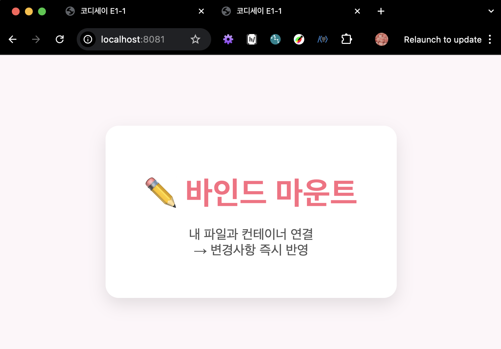
</details>

#### 2) 볼륨과 영속성
- 볼륨: `Docker`가 별도로 관리하는 컨테이너와 분리된 데이터 저장 공간
- 영속성: 컨테이너를 삭제하면 내부 데이터도 함께 삭제되는데, 볼륨을 사용하는 경우 데이터 유지 → 영속성 보장
- `docker run -it --name <컨테이너 이름> -v <볼륨 이름>:<컨테이너 내부 경로>`
<details>
<summary>실습 내용</summary>

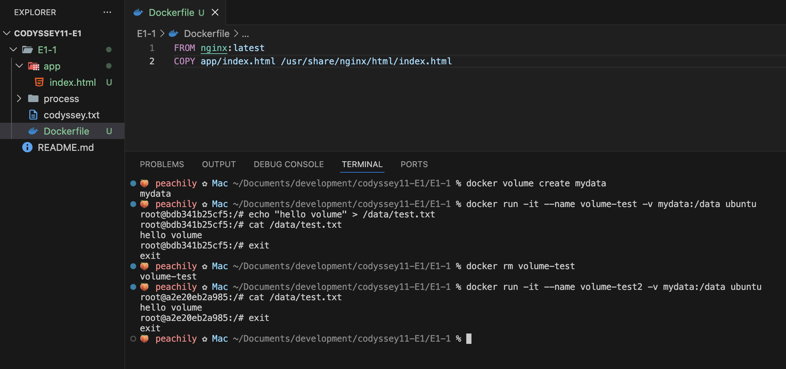
</details>

### 3-7. Docker Compose
#### 1) 단일 서비스 실행
#### 2) 환경 변수
#### 3) 멀티 컨테이너

---
## 4. Github 연동
22.png
31.png
---
## 5. 트러블 슈팅
