# [E1-2] Git과 함께하는 Python 첫 발자국
---
## 목차
| | |
|---|---|
| 1 | [프로젝트 개요](#1-프로젝트-개요) |
| 2 | [실행 방법](#2-실행-방법) |
| 3 | [파일 구조](#3-파일-구조) |
| 4 | [Git 활용](#4-git-활용) |
| | |
---
## 1. 프로젝트 개요
### 1-1. 주제
- Python으로 만든 콘솔 기반 퀴즈 게임
- 퀴즈 주제: '나' → 평가를 진행하면서 코디세이 동료분들과 친해지고자 선정함 🫶🏻

### 1-2. 기능 목록
- 게임 실행: 터미널에서 `python3 main.py` 명령어를 입력해 게임을 실행
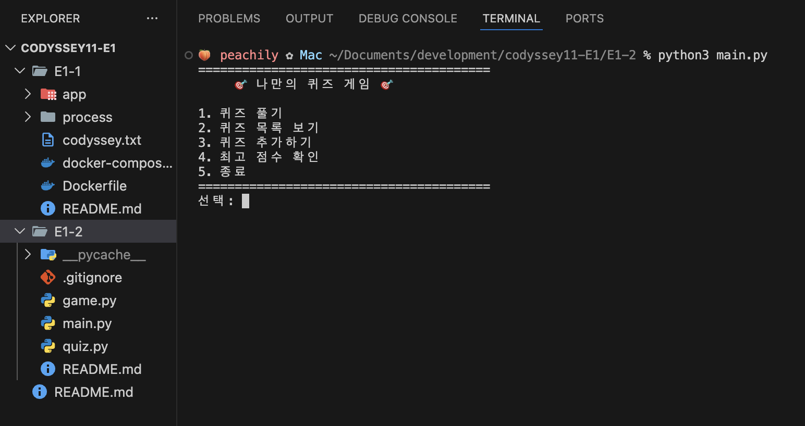

- 등록된 퀴즈 목록 확인: 메뉴에서 2번을 선택해 등록되어 있는 퀴즈 질문들을 확인
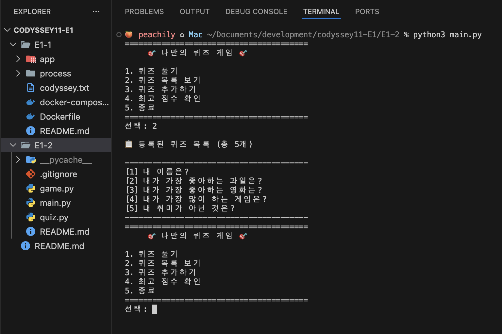

- 퀴즈 풀기: 메뉴에서 1번을 선택해 등록된 퀴즈를 순서대로 풀이. 정답 여부 즉시 확인 가능
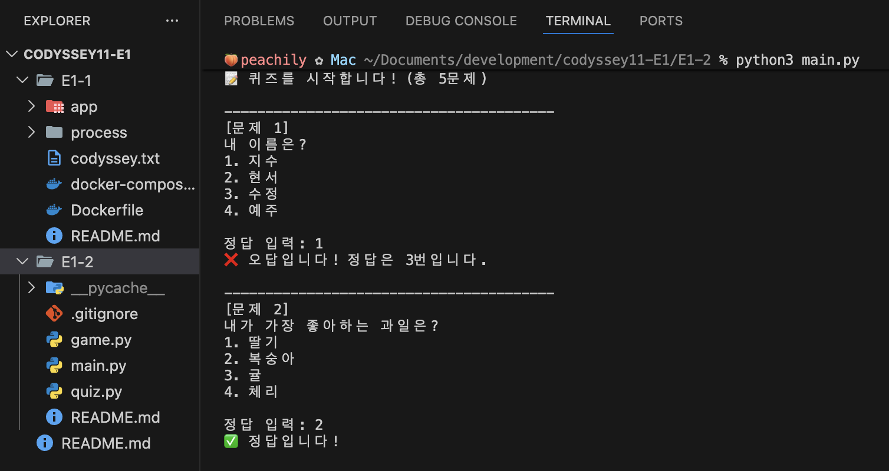

- 점수 확인: 모든 문제를 풀면 맞힌 문제 수(점수)를 확인 가능. 메뉴에서 4번을 선택하면 최고 점수 확인 가능
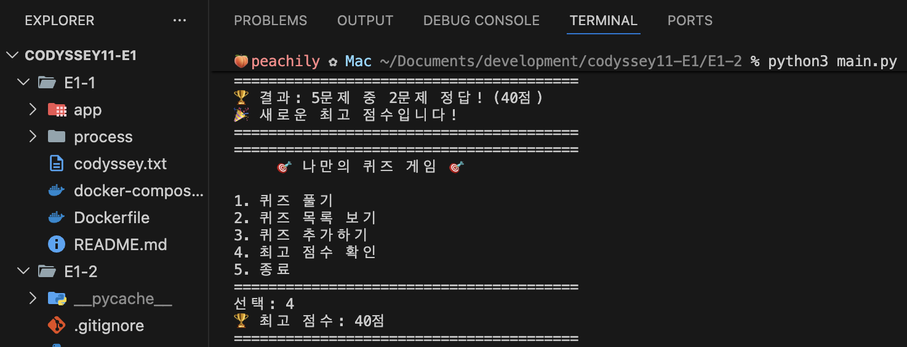

- 퀴즈 추가하기: 메뉴에서 3번을 선택해 퀴즈를 새로 추가. 문제와 선택지, 정답 번호는 지정된 형식에 맞게 입력해야 함
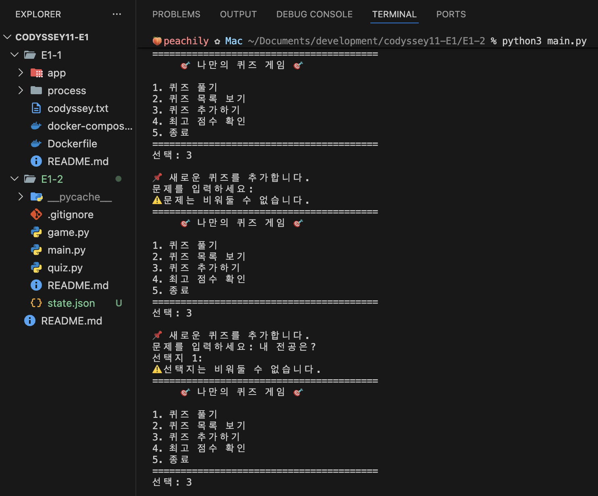
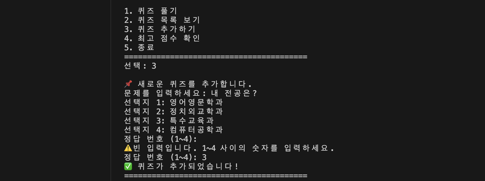
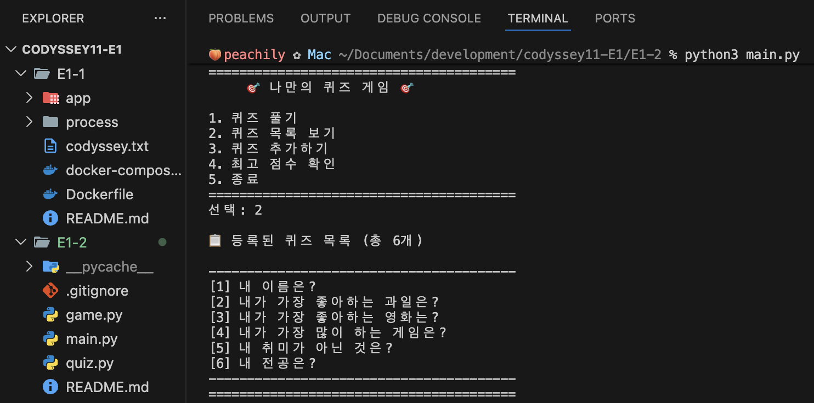

- 안전 종료: 프로그램 실행 중 `Ctrl+C` 또는 `Ctrl+D` 입력 시 예외 처리를 통해 프로그램이 비정상적으로 종료되지 않고, 안내 메시지를 출력한 후 안전하게 종료됨
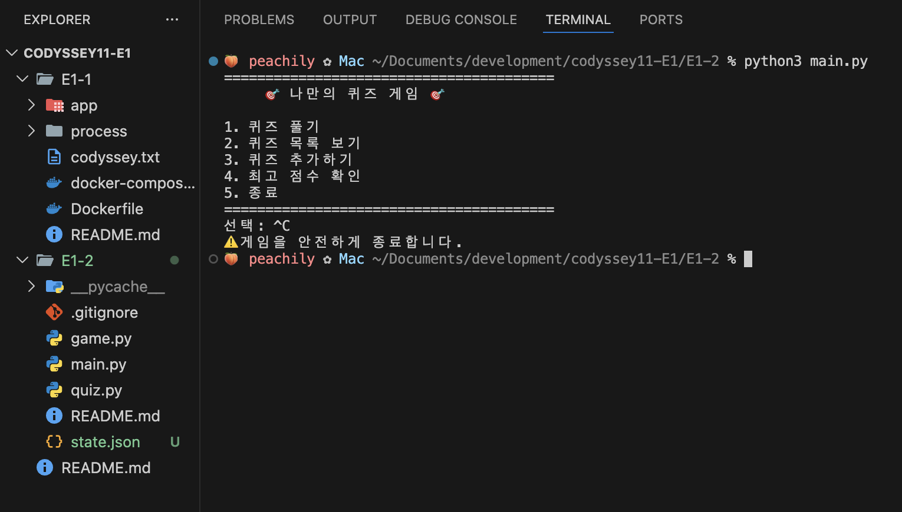

---
## 2. 실행 방법
아래 명령어를 입력해 프로그램을 실행
```bash
python3 main.py
```

---
## 3. 파일 구조
### 3-1. 전체 구조
```bash
quiz-game/
├─ main.py
├─ game.py
├─ quiz.py
├─ state.json
├─ README.md
└─ .gitignore
```

### 3-2. 데이터 파일
- 경로: 프로젝트 루트의 `state.json`
- 역할: 퀴즈 목록 저장, 최고 점수 저장 → 프로그램을 종료해도 데이터를 유지
- 필드 구조
    ```json
    {
        "quizzes": [
            {
                "question": "<질문>",
                "choices": ["<1번 선택지>", "<2번 선택지>", "<3번 선택지>", "<4번 선택지>"],
                "answer": <정답 번호>
            }
        ],
        "best_score": <최고 점수>
    }
    ```

---
## 4. Git 활용
### 4-1. Git 작업 흐름
- Git은 로컬 저장소와 원격 저장소(GitHub) 간의 작업을 통해 코드의 변경 이력을 관리함
- 작업 디렉토리 → `add` → `commit` → `push` → (다른 환경에서 `pull`)
    - `add`: 수정된 파일을 스테이징 영역에 올리는 과정
    - `commit`: 스테이징된 파일의 변경 내용을 하나의 기록으로 저장하는 과정
    - `push`: 로컬 저장소의 커밋 내용을 원격 저장소(GitHub)에 반영하는 과정
    - `pull`: 원격 저장소의 변경 내용을 로컬로 가져와 최신 상태로 유지하는 과정

### 4-2. 브랜치 및 병합
- 브랜치를 통해 작업 내용을 분리하여 관리 → 기존 코드에 영향을 주지 않고 새로운 기능을 개발 가능
- 명령어
    - `git branch`: 브랜치 목록 확인
    - `git checkout -b <브랜치명>`: 새로운 브랜치 생성 및 이동
    - `git checkout <브랜치명>`: 특정 브랜치로 이동
    - `git merge <브랜치명>`: 다른 브랜치의 작업 내용을 현재 브랜치에 병합
- 기능 단위로 작업을 분리하고, 안정적으로 코드 변경 사항을 관리하기 위해 사용함
    - (1) `main` 브랜치에서 새로운 브랜치 생성
    - (2) 기능 개발 진행 후 `commit`
    - (3) `main` 브랜치로 돌아와 `merge` 수행
<details>
<summary>실습 내용</summary>

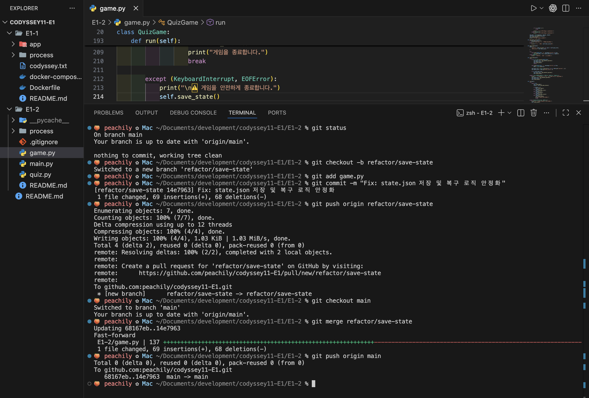
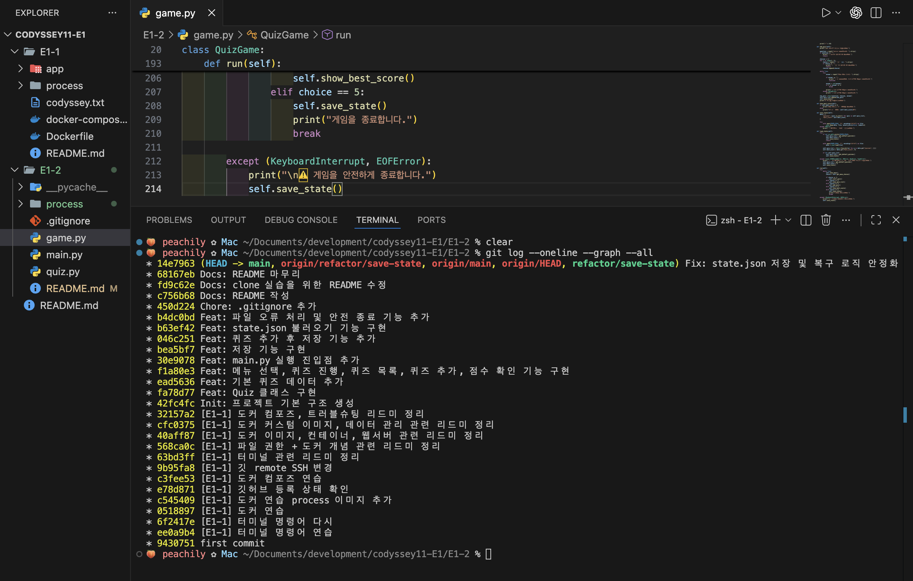
</details>

### 4-3. Git clone
- GitHub는 여러 환경에서 동일한 프로젝트를 공유하고 협업할 수 있도록 원격 저장소를 제공하는 플랫폼
- `git clone`을 사용하면 기존 프로젝트를 그대로 가져와 동일한 작업 환경을 구성할 수 있음
<details>
<summary>실습 내용</summary>

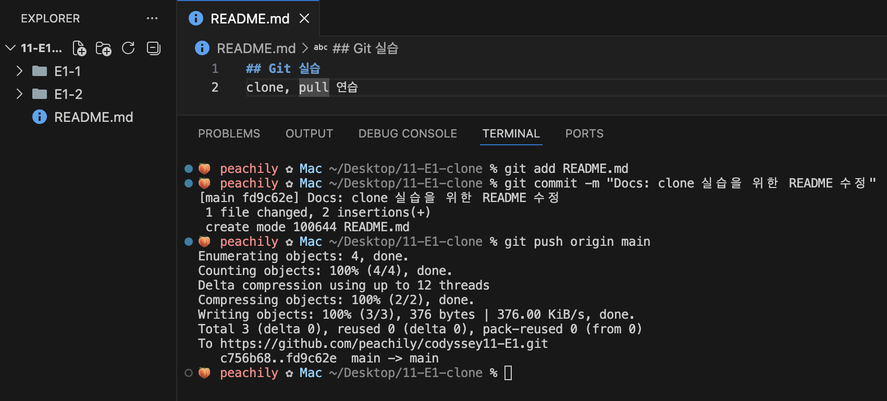
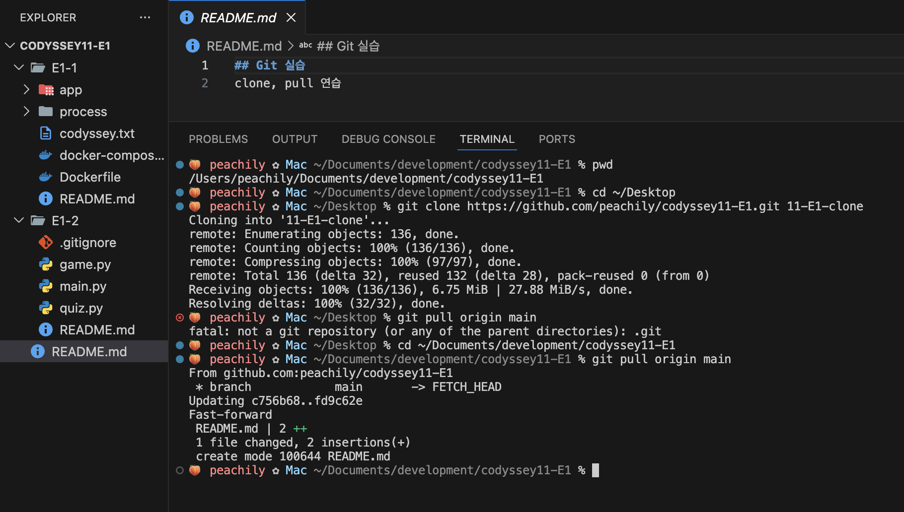
</details>

### 4-4. Git 이력 확인
- Git은 모든 변경 사항을 커밋 단위로 기록하며, 이를 통해 작업 이력을 확인할 수 있음
- 프로젝트의 변경 흐름과 작업 과정을 파악하고 버전 관리의 핵심적인 역할을 수행
- `git log --oneline --graph`
    - `git log`: 커밋 이력을 상세하게 확인하는 명령어
    - `git log --oneline`: 커밋을 한 줄로 간단하게 출력
    - `git log --oneline --graph`: 커밋 흐름을 그래프 형태로 시각적으로 확인

<details>
<summary>실습 내용</summary>

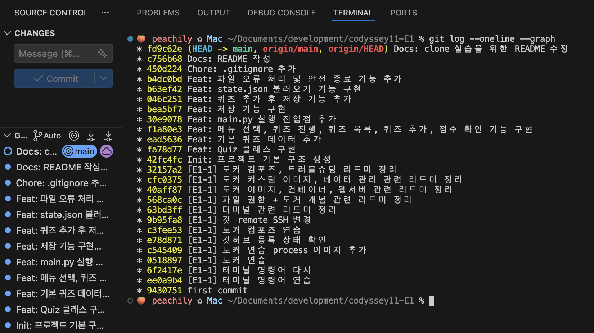
</details>